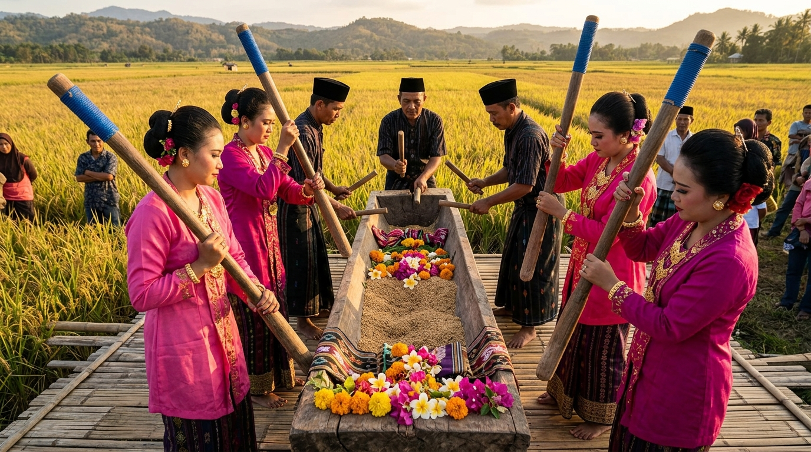

# 🌾 Pesta Panen Mappere dan Mappadendang

> **Website resmi dokumentasi tradisi Pesta Panen Mappere dan Mappadendang di Calodo, Kecamatan Cenrana, Kabupaten Bone, Sulawesi Selatan.**



---

## ✨ Tentang Proyek Ini

Proyek ini lahir dari keinginan sederhana: **agar tradisi yang diwariskan leluhur tidak hilang ditelan zaman**.

Website ini didedikasikan untuk mendokumentasikan **Pesta Panen Calodo** — sebuah tradisi tahunan yang dirayakan oleh masyarakat Calodo di Kecamatan Cenrana, Kabupaten Bone, Sulawesi Selatan. Setiap tahun, setelah musim panen padi dan kebun, warga Calodo berkumpul untuk merayakan syukur dalam rangkaian kegiatan adat yang kaya makna, penuh semangat, dan mempererat tali persaudaraan.

Dibuat dengan penuh rasa cinta terhadap tanah leluhur. Terbuka untuk umum *(open source)* agar siapa pun bisa ikut menjaga dan melestarikannya.

---

## 📖 Sejarah Tradisi

### Akar yang Dalam

Pesta Panen Calodo bukanlah sekadar perayaan — ia adalah bentuk **rasa syukur yang mengakar** dalam kehidupan agraris masyarakat Bugis. Sawah dan kebun adalah nafas kehidupan. Ketika panen berhasil, seluruh warga merayakannya bersama.

Tradisi ini berlangsung setiap tahun, **mulai pukul 09.00 hingga malam**, dipenuhi tiga rangkaian kegiatan utama yang masing-masing memiliki makna tersendiri.

---

### 🥁 Mappadendang — Penumbukan Gabah Berirama

**Mappadendang** adalah ritual penumbukan gabah yang diiringi irama perkusi dari lesung kayu. Bukan sekadar menumbuk — ini adalah seni, musik, dan doa yang menyatu.

**Lesung Calodo** berbentuk **kotak persegi panjang** (bukan melengkung), diisi dengan gabah, bunga-bunga segar, kain berwarna-warni, dan dedaunan sebagai simbol kesuburan.

**Formasi pemain:**
- **4 Perempuan** wajib mengenakan **Baju Bodo Bugis** — pakaian tradisional berwarna cerah lengkap dengan perhiasan emas. Mereka berdiri dalam 2 pasang saling berhadapan, dengan lesung di tengah, memukul padi ke dalam lesung secara berselang-seling menggunakan alu panjang yang dihias plastik/kain biru.
- **3 Pria** di ujung belakang lesung membentuk **formasi segitiga**:
  - 1 pria menghadap **ke depan** (penonton), memegang tongkat pendek dengan **kedua tangan**, memukul bagian kayu lesung
  - 2 pria lainnya **saling berhadapan** di kanan-kiri ujung lesung, memukul bagian kayu secara bergantian

> *"Sisi kiri memainkan 2 ketukan, sisi kanan memainkan 3 ketukan — perpaduan irama yang menciptakan melodi perkusi khas Calodo."*

---

### 🏋️ Mappere' — Ayunan Raksasa

**Mappere'** adalah puncak atraksi yang paling ditunggu-tunggu. Sebuah ayunan raksasa yang mengayun manusia ke udara, disaksikan oleh ribuan penonton.

**Struktur ayunan:**

```
        [bambu pendek horizontal — gantungan tali]
       /                                          \
      /  bambu penyangga      bambu penyangga      \
     /                                              \
[TIANG KAYU BESAR KIRI]          [TIANG KAYU BESAR KANAN]
       ↑ ujung tidak menyentuh ↑
```

- **2 tiang kayu besar** condong ke dalam — ujungnya **tidak saling menyentuh**
- Masing-masing tiang ditopang **2 bambu penyangga** (total 4 bambu)
- Di puncak kedua tiang, dipasang **1 bambu pendek horizontal** sebagai gantungan tali
- Tali menjulur dari bambu horizontal, diikatkan ke **kursi kayu** tempat duduk peserta

**Cara mengayun:**
- 2 orang pemegang tali berdiri kanan-kiri, berlari kompak menarik-mendorong tali
- Semakin kompak dan semakin jauh mereka berlari, semakin tinggi ayunan
- Setiap sesi: **7 kali ayunan** sebelum peserta berganti
- Perempuan yang diayun mengenakan **baju bodo adat Bugis** lengkap dengan perhiasan

---

### ⚽ Final Olahraga

Kompetisi olahraga sudah bergulir sejak hari-hari sebelum pesta. Ketika hari pesta tiba, yang tersaji adalah **babak final**:

| Cabang | Peserta |
|--------|---------|
| Voli Putra | Tim terbaik dari penyisihan |
| Sepak Takraw Putra | Tim terbaik dari penyisihan |

Malam harinya: **upacara penyerahan hadiah** sebagai penutup seluruh rangkaian pesta.

---

## 🌊 Tapparareng — Keajaiban Alam Calodo

Di Calodo terdapat kawasan unik yang disebut **Tapparareng**: lahan pertanian dengan sungai di sisinya yang berubah wajah mengikuti musim.

| Musim | Wujud | Aktivitas |
|-------|-------|-----------|
| **Hujan** | Danau luas 🌊 | Perahu tradisional & **mottoro tassi** mengangkut karung padi |
| **Kering** | Sawah subur 🌾 | Menanam padi |

**Ikan-ikan di Tapparareng:**
Ikan Mujair · Ikan Gabus · Belut · Bale Cambang · Bale Ceppe' · Bale Jahele · Bale Salo · Lenrong · Bale Kamboja

---

## 🛠️ Teknologi

Website ini dibangun menggunakan:

| Teknologi | Kegunaan |
|-----------|----------|
| [Astro v5](https://astro.build) | Framework web modern, cepat |
| Vanilla CSS | Styling tanpa dependensi berlebihan |
| TypeScript | Script interaktif (particle canvas, musik, dll) |
| Cormorant Garamond + Inter | Tipografi editorial profesional |

**Struktur proyek:**
```
src/
├── components/
│   ├── Navbar.astro          — Navigasi sticky + mobile
│   ├── Hero.astro            — Canvas particles + parallax
│   ├── Tentang.astro         — Tentang pesta panen + metrik
│   ├── Tapparareng.astro     — Keajaiban alam Calodo
│   ├── Rundown.astro         — Timeline jadwal acara
│   ├── Mappadendang.astro    — Ritual penumbukan gabah
│   ├── Mappere.astro         — Ayunan raksasa
│   ├── Olahraga.astro        — Final voli & sepak takraw
│   ├── Footer.astro          — Footer
│   └── MusicPlayer.astro     — Pemutar lagu Bugis
├── layouts/Layout.astro      — HTML shell utama
├── pages/index.astro         — Halaman utama
└── styles/global.css         — Design tokens & utilities
public/
├── img/                      — Gambar ilustrasi
│   ├── mappadendang.jpg
│   ├── mappere.jpg
│   ├── olahraga.jpg
│   └── tapparareng.jpg
└── audio/
    └── bugis_tana_ogi_wanuakku.mp3  — Lagu latar Bugis
```

---

## 🚀 Cara Menjalankan

```bash
# Clone repositori
git clone https://github.com/[username]/LABONGNGE.git
cd LABONGNGE

# Install dependencies
npm install

# Jalankan di lokal
npm run dev
# → http://localhost:4321

# Build untuk produksi
npm run build
```

---

## 🎵 Musik Latar

Website ini dilengkapi lagu daerah Bugis **"Tana Ogi Wanuakku"** sebagai musik latar yang diputar otomatis saat pengunjung pertama kali berinteraksi dengan halaman. Dilengkapi dengan kontrol volume dan tombol play/pause yang elegan.

---

## 🌐 Deployment

Website ini dapat diakses di:
> 🔗 **[https://labongnge.aksesdesa.id](https://labongnge.aksesdesa.id)**

---

## 🤝 Kontribusi

Proyek ini **open source** dan terbuka untuk semua orang. Jika kamu warga Calodo, peneliti budaya, atau siapa pun yang ingin berkontribusi — baik berupa koreksi informasi, foto asli, atau perbaikan teknis — silakan:

1. **Fork** repositori ini
2. Buat branch baru: `git checkout -b fitur-kamu`
3. Commit perubahan: `git commit -m 'Tambah: [deskripsi]'`
4. Push branch: `git push origin fitur-kamu`
5. Buat **Pull Request**

---

## 📜 Lisensi

Proyek ini menggunakan lisensi **MIT** — bebas digunakan, dimodifikasi, dan didistribusikan dengan menyertakan atribusi.

---

## 🙏 Penghargaan

Kepada seluruh **masyarakat Calodo, Cenrana, Bone** yang telah menjaga tradisi ini dari generasi ke generasi.

Kepada para tetua, pemain Mappadendang, peserta Mappere', dan semua warga yang hadir setiap tahun — kalian adalah penjaga warisan yang sesungguhnya.

---

<div align="center">

**Calodo · Cenrana · Bone · Sulawesi Selatan**

*Merayakan syukur, melestarikan warisan leluhur, mempererat tali persaudaraan.*

⭐ Jika proyek ini bermanfaat, berikan bintang di GitHub!

</div>
